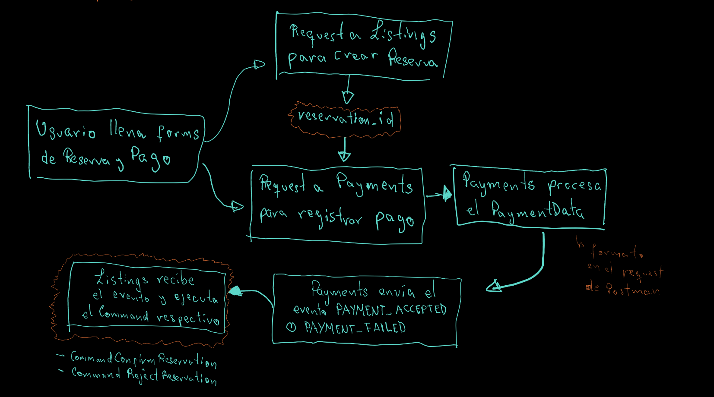
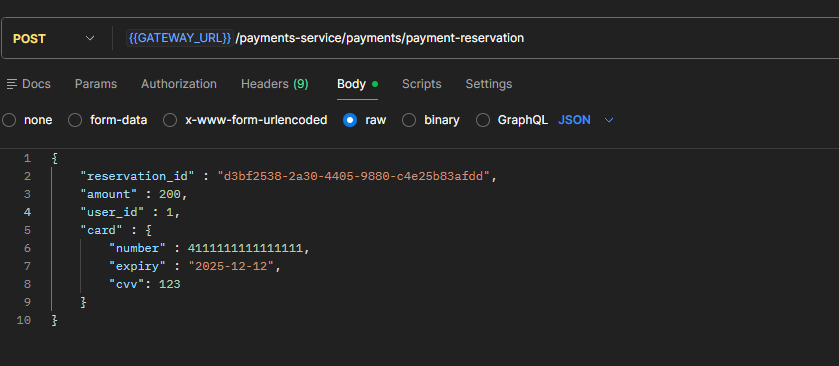

# Ciclo completo de Creacion de Reserva, pago y Confirmacion de reserva #

##### Nota: El nombre correcto del evento es *PAYMENT_COMPLETED*, no PAYMENT_ACCEPTED



Este documento describe el flujo completo que seguirá la operacion de reservar un lugar (usuario CLIENT)

1. En el frontend, el usuario completará 2 formularios (o 1 formulario con 2 pasos) donde llena los datos de su reserva y su forma de pago

2. Al microservio de listings se enviará los datos de la reserva, que se creará con un estado de "PENDIENTE" (u otro nombre similar).

3. Al crearse el objeto de reservation, el servicio Listings devolverá su id *reservation_id* (y otros campos que se considere necesario).  
Este *reservation_id* se usará para enviar una request al servicio de Payments ***(payment-service/payments/payment-reservation)*** con el PaymentData (datos minimos):  



4. Al procesarse el pago (fallo o exito), se enviará el evneto respectivo PAYMENT_FAILED, PAYMENT_COMPLETED, cuyo contendio será este
```json
{
	"topic_name": "payment_events",
	"event_name": "PAYMENT_COMPLETED",
	"event_value": {
		"id": 2,
		"reservation_id": "d3bf2538-2a30-4405-9880-c4e25b83afdd",
		"amount": 200,
		"status": "SUCCESS",
		"receipt_hash": -6315913857979408984,
		"user_id": 1
	}
}
```

5. Listings recibirá estos eventos y procesará acorde (cambiando los estados de la reserva) en el microservicio de Listings (*listing/infrastructure/components*) en la clase KafkaEventListener:  
```java
@KafkaListener(
            topics = {"payment_events"},
            groupId = "${spring.kafka.consumer.group-id}"
    )
    public void handleRawEvent(String rawEventMessage) {

        try {
            JsonNode root = objectMapper.readTree(rawEventMessage);

            String eventName = root.path("event_name").asText(null);
            JsonNode eventValue = root.path("event_value");

            log.info("➡ Event name: {}", eventName);

            // Example: call domain logic / service
            this.handlePaymentEvent(eventName, eventValue);

        } catch (Exception e) {
            log.error(e.getMessage());
            log.error("[ERROR] Failed to parse Kafka message: {}", rawEventMessage, e);
        }
    }

    private void handlePaymentEvent(String eventName, JsonNode eventValue){
        switch (eventName){
            case "PAYMENT_COMPLETED":
                String paymentId = eventValue.path("id").asText();
                String reservationId = eventValue.path("reservation_id").asText();
                log.info("Processing PAYMENT_COMPLETED for paymentId: {}, reservation: {}", paymentId, reservationId);
                //AQUI SE LLAMA AL COMMAND PARA CONFIRMAR LA RESERVA
                break;
            case "PAYMENT_FAILED":
                String failedPaymentId = eventValue.path("id").asText();
                log.info("Processing PAYMENT_FAILED for paymentId: {}", failedPaymentId);
                //AQUI SE LLAMA AL COMMAND PARA CANCELAR LA RESERVA
                break;
            case "TEST_EVENT":
                log.info("Received TEST_EVENT with data: {}", eventValue.toString());
                break;
            default:
                log.warn("Unhandled payment event: {}", eventName);
        }
    }
```

De esta el ciclo completo habría sido manejado correctamente. 

## Consideraciones para el frontend ##
Lo ideal sería que cuando se envie el formulario desde el frontend, mientras ocurre todo el ciclo descrito en este documento, se muestre un modal/page con indicaciones de que se está procesando el pago. 

Este modal enviará un request cada 0.5 segundos a un endpoint del estilo: 
```json
api/listings-service/reservation/{:reservation_id}/check-status
```
Cuya respuesta devolverá el estado de la reserva, si el estado fuera "ACCEPTED" (o similar); "REJECTED" (o similar), el modal/pantalla de espera terminará y le mostrará al usuario un mensaje que indique la reserva se completó