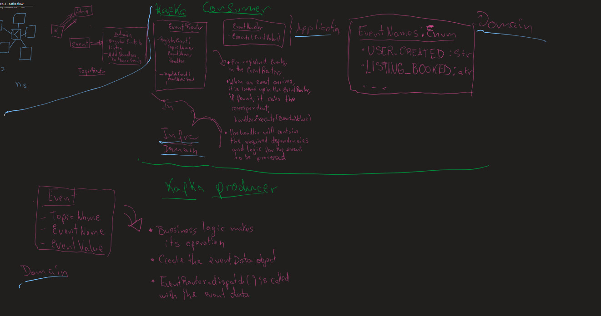

# SISTEMA DE EVENTOS CON KAFKA Y PYTHON #

#### Author: Sebastian Rengel Claros ####

## Primeros pasos ##

1. Seguir las instrucciones del README.md para levantar el microservicio admin junto
con Kafka.

2. Teniendo levantado kafka, el microservicio de Admin y el consumer de Kafka,
podemos proceder

## Concepto de Evento ##
Un evento es un mensaje que se envia desde un productor (un microservicio)
a un consumidor (otro microservicio) a traves de un intermediario (Kafka).
El evento contiene informacion relevante sobre una accion que ha ocurrido
en el sistema, como por ejemplo la creacion de un nuevo usuario o la
reserva de una propiedad.

## Partes de un Mensaje/Evento kafka ##
Un mensaje de Kafka esta compuesto por los siguientes elementos:
- Topic: Es el grupo a traves del cual se envian los mensajes. Cada
- Nombre del evento: Es un string que identifica el tipo de evento
- Valor del evento: Es un diccionario que contiene la informacion relevante

## NOMENCLATURA DE NOMBRES DE EVENTOS Y TOPICS ##
- Los nombres de eventos deben estar en mayusculas y separados por guiones bajos.
e.g: **USER_CREATED, CLAIM_ADDED, CLAIM_REMOVED**
- Los nombres de topics deben estar en minusculas y separados por guiones bajos.
e.g: **user_events, claim_events**

----------------------------------

## Consumidor de eventos en Python con Kafka ###



Para registrar eventos a procesar en nuestros microservicios python, en el proyecto
de DJango, debemos contar con estar carpetas en nuestro proyecto:
- application_layer (contiene la logica de registro, el thread que ejecuta el consumer,
y la carpeta de handlers, que contiene los manejadores de eventos)
- domain_layer (contiene los modelos de dominio y las interfaces de servicios)
- infrastructure_layer (contiene la implementacion de las interfaces de servicios,
como el EventRouter y el EventProcessor)

### Como registrar eventos a procesar en nuestros microservicios python ###
1. Agregar el evento a los Enums en domain_layer/enums/ (sea event o topic)
e.g: 
````python
class Events(Enum):
    USER_CREATED = "USER_CREATED"
    CLAIM_ADDED = "CLAIM_ADDED"
    CLAIM_REMOVED = "CLAIM_REMOVED"
````

2. Crear el handler para el evento en application_layer/handlers/(carpeta correspondiente)
e.g: para el evento CLAIM_ADDED, crear el archivo claim_added_handler.py  
**NOTESE QUE EL HANDLER HEREDA DE EventHandlerInterface** POR ENDE
DEBE IMPLEMENTAR EL METODO execute (DE LO CONTRARIO SALTARA UN ERROR)
````python
class ClaimAddedHandler(EventHandlerInterface):

    def execute(self, event_value : dict):
        data = event_value.get("data", {})
        user_id = event_value.get('userId')
        claim_id = data.get('id')
        role_id = data.get('roleId')

        audit_log = AuditLog(
            action="OTHER",
            user_id=user_id,
            description=f"Claim added with ID: {claim_id} to Role ID: {role_id}",
            entity_name="Roles",
            new_value=json.dumps(event_value)
        )

        audit_log.save()
        print(f"[EVENT HANDLER] Processed CLAIM_ADDED for claim_id: {claim_id}")
````
3. Register el el evento y su handler en el GLOBAL_REGISTRATION, dentro de
application_layer/global_event_registration.py, agregar una nueva entrada 
para el evento. 
**NOTESE QUE SE DEBE USAR LOS ENUMS CREADOS EN EL PASO 1 PARA EL TOPIC Y EL EVENTO**,
pero debemos pasar el enum.value para obtener el string correspondiente.  
Ademas, evidentemente pasar una instancia del handler creado en el paso 2.
````python
def global_event_registration(event_processor):
    """
        AQUI SE REGISTARAN TODOS LOS EVENTOS ANTES DE PODER USARLOS
    """
    # Registro de eventos de usuario
    event_processor.event_router.register_event(
        Topics.USER_EVENTS.value,
        Events.USER_CREATED.value,
        UserCreatedHandler()
    )
    
    #### otros eventos de usuario... ###

    # Registro de eventos de rol
    event_processor.event_router.register_event(
        Topics.ROLE_EVENTS.value,
        Events.CLAIM_ADDED.value,
        ClaimAddedHandler()
    )

    #### otros eventos de rol... ###
````

5. Y listo, ya tenemos el handler para el evento registrado y listo para ser
procesado por el consumer de Kafka.

----------------------------------

## Productor de eventos en Python con Kafka ##
Para enviar eventos desde nuestros microservicios python, en el proyecto


