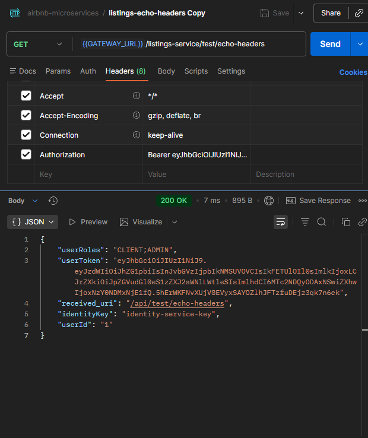

# Headers Agregados por el API Gateway #

Se configuró APISIX para **OPCIONALMENTE** recibir el header
```
Authorization: Bearer [[jwt_token]]
```

Enfasis en **OPCIONALMENTE**, pues se configuró de tal manera que la request no sea rechazada de no enviarse ese header. Esto *PUEDE O NO* ser una medida temporal, que se implementó para no retrasar el progreso del proyecto

## Flujo ##
1. El usuario envia su request con el encabezado (donde [[jwt_token]] es 
el token generado por identity/register o identity/login) :
```
Authorization: Bearer [[jwt_token]]
```

2. El request es procesado por el API-GATEWAY y este decompono el token jwt en 3 nuevos headers:
```
X-User-Id: [[id int del usuario]]

X-User-Roles: [[Lista de roles (string) separados por ";" ]]

X-Identity-Key: [[Signature del servicio]]

X-User-Token: [[El token original del usuario a usarse por el servicio DE SER NECESARIO]]
```

Creé un endpoint para probar que se envien correctamente los headers. Este se encuentra en los servicios de Identity y Listings, en los TestControllers respectivos de cada servicio. 
```java
@GetMapping("/echo-headers")
    public ResponseEntity<Map<String, String>> getDiagnosticInfo(
            @RequestHeader(name = "X-User-Id", required = false) String userIdHeader,
            @RequestHeader(name = "X-User-Roles", required = false) String rolesHeader,
            @RequestHeader(name = "X-User-Token", required = false) String userToken,
            @RequestHeader(name = "X-Identity-Key", required = false) String identityKeyHeader,
            HttpServletRequest request) {

        Map<String, String> diagnostics = new HashMap<>();

        // We expect the subject ("admin") to appear here
        diagnostics.put("userId", Optional.ofNullable(userIdHeader).orElse("ANONYMOUS"));
        diagnostics.put("userRoles", Optional.ofNullable(rolesHeader).orElse("NONE"));
        diagnostics.put("userToken", Optional.ofNullable(userToken).orElse("NONE"));

        // --- APISIX URI REWRITE CHECK ---
        diagnostics.put("received_uri", request.getRequestURI());

        diagnostics.put("identityKey", Optional.ofNullable(identityKeyHeader).orElse("NONE"));

        return ResponseEntity.ok(diagnostics);
    }
```
Al enviarse el token con el Header de Authorization en la request original a este endpoint, el header devolverá este formato de respuesta




Evidentemente, Si no se envia el token, los valores de respuesta seran valores genericos (NONE, ANONYMOUS, etc)

## Notas importantes ##
- NO SE ESTÁ VALIDANDO LA SIGNATURE DE JWT, simplemente se descompone el token, CADA MICROSERVICIO se encargará de asegurar la integridad del token con la signature (el jwt-secret)
- Cada microservicio debe validar si los roles que está recibiendo en los headers son aptos para sus endpoint (manejo de permisos)